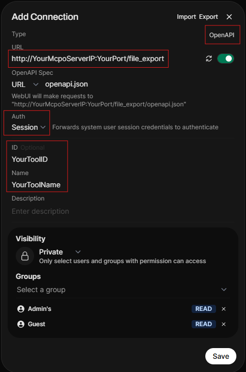
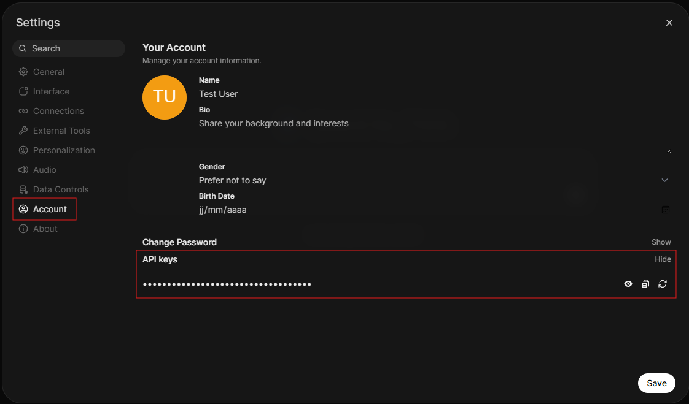
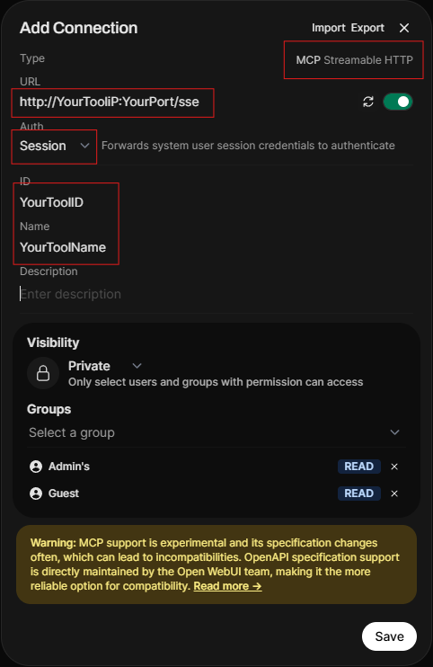
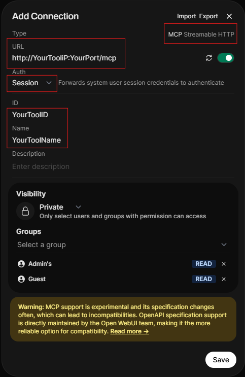

# Docker (recommended)
## builtin MCPO server
### Configure the tool
- Pull image with wanted tag
   - configure with env variables
        ```yaml
        services:
        file-export-server:
            image: ghcr.io/glissemantv/owui-file-export-server:latest
            container_name: file-export-server
            environment:
            - FILE_EXPORT_DIR=/output
            ports:
            - "yourport:9003"
            volumes:
            - /your/export-data:/output # <==must match with the folder where the gen-server will build files

        owui-mcpo:
            image: ghcr.io/glissemantv/owui-mcpo:latest
            container_name: owui-mcpo
            environment:
            - FILE_EXPORT_BASE_URL=http://file-export-server:9003/files # <== this url must point to file-export-server:yourport/files above
            - FILE_EXPORT_DIR=/output
            - PERSISTENT_FILES=true
            - FILES_DELAY=1
            - LOG_LEVEL=INFO
            - UNSPLASH_ACCESS_KEY=top-secret
            - IMAGE_SOURCE=local_sd
            - LOCAL_SD_URL=http://localhost:7860
            - LOCAL_SD_USERNAME=local_user
            - LOCAL_SD_PASSWORD=local_password
            - LOCAL_SD_DEFAULT_MODEL=sd_xl_base_1.0.safetensors
            - LOCAL_SD_STEPS=20
            - LOCAL_SD_WIDTH=512
            - LOCAL_SD_HEIGHT=512
            - LOCAL_SD_CFG_SCALE=1.5
            - LOCAL_SD_SCHEDULER=Karras
            - LOCAL_SD_SAMPLE=Euler a
            - OWUI_URL=http://localhost:8000
            ports:
            - "yourport:8000"
            restart: unless-stopped
            volumes:
            - /your/export-data:/output # <==must match with the folder where the file-server will host files
            depends_on:
            - file-export-server
        ```
### Configure Open WebUI
1. Go to Admin settings \ Settings
    1. General
        1. Check "Enable API Key"
    2. External tools
        1. Add new tool
        2. Follow the insctruction below

        
2. User settings
    1. Account
        1. Generate new API key if not already done so
        
        


## SSE / HTTP transport server
### Configure the tool
- Pull image with wanted tag
   - configure with env variables
        ```yaml
        services:
        file-export-server:
            image: ghcr.io/glissemantv/owui-file-export-server:latest
            container_name: file-export-server
            environment:
            - FILE_EXPORT_DIR=/output
            ports:
            - "yourport:9003"
            volumes:
            - /your/export-data:/output # <==must match with the folder where the gen-server will build files

        owui-mcpo:
            image: ghcr.io/glissemantv/file-gen-sse-http:latest
            container_name: owui-mcpo
            environment:
            - FILE_EXPORT_BASE_URL=http://file-export-server:9003/files # <== this url must point to file-export-server:yourport/files above
            - FILE_EXPORT_DIR=/output
            - PERSISTENT_FILES=true
            - FILES_DELAY=1
            - LOG_LEVEL=INFO
            - UNSPLASH_ACCESS_KEY=top-secret
            - IMAGE_SOURCE=local_sd
            - LOCAL_SD_URL=http://localhost:7860
            - LOCAL_SD_USERNAME=local_user
            - LOCAL_SD_PASSWORD=local_password
            - LOCAL_SD_DEFAULT_MODEL=sd_xl_base_1.0.safetensors
            - LOCAL_SD_STEPS=20
            - LOCAL_SD_WIDTH=512
            - LOCAL_SD_HEIGHT=512
            - LOCAL_SD_CFG_SCALE=1.5
            - LOCAL_SD_SCHEDULER=Karras
            - LOCAL_SD_SAMPLE=Euler a
            - OWUI_URL=http://localhost:8000
            - OWUI_JWT_TOKEN=jwt-token-h # (only for edit/review used behind an external mcpo server / no longer used if you are using SSE/HTTP direct in OWUI)
            ports:
            - "yourport:9004"
            restart: unless-stopped
            volumes:
            - /your/export-data:/output # <==must match with the folder where the file-server will host files
            depends_on:
            - file-export-server
        ```
### Configure Open WebUI
1. Go to Admin settings \ Settings
    1. General
        1. Check "Enable API Key"
    2. External tools
        1. Add new tool
        2. Follow the insctruction below
            - For SSE, use /sse endpoint
            - for http, use /mcp endpoint


            
2. User settings
    1. Account
        1. Generate new API key if not already done so

        
